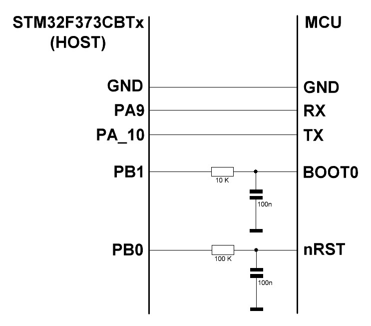

## Тестовое задание STM32

>На STM32F373 реализовать функцию контроля ПО, загруженного в другой МК(STM32F405), используя встроенный USART загрузчик STM32.
> 
>Т.е. нужно:
>1) Соединить необходимые для реализации данной функции пины двух STM32. 
>2) Написать прошивку для STM32F373, которая при включении переводит STM32F405 в режим загрузчика, производит проверку целостности прошивки в STM32F405, используя алгоритм CRC16, и в случае успешной проверки выполняет старт STM32F405. 
>
>Контрольная сумма прошивки хранится также во FLASH памяти STM32F405.
>Среда разработки любая, язык Си.


## Комментарии к реализации

1. В задании не указаны конкретные адреса размещения CRC16 в памяти проверяемого устройства. Выбран случайный адрес.
2. Размер проверяемой прошивки читается из того же региона Flash что и CRC.
3. Не имея под рукой платы на базе STM32F373 и STM32F405, использовал для проверки две платы Nucleo-L476. Пример для STM32F373 реализован на базе MCU STM32F373CBTx.

## Схема подключения



## Требуемое для сборки ПО

1. CMake >= v3.20
2. Ninja >= v1.10
3. GNU ARM Embedded Toolchain - latest

## Сборка задания для платы `board/f373`

Перейти в корень репозитория проекта:
```sh
cd path_to_repo
```

Запуск CMake-конфигурирования для Debug-сборки:
```sh
cmake -B build -GNinja -DCMAKE_TOOLCHAIN_FILE="../cmake/toolchain-arm-none-eabi.cmake" -DBOARD=f373 -DCMAKE_BUILD_TYPE=Debug .
```

Сборка приложения:
```sh
ninja -C build
```

Результат сборки в консоли:
```
text   data	    bss	    dec	    hex	filename
9160     32	   2040	  11232	   2be0	app
```

Артефакты сборки:

- ELF файл - `build/source/app`
- BIN файл - `build/source/app.bin`